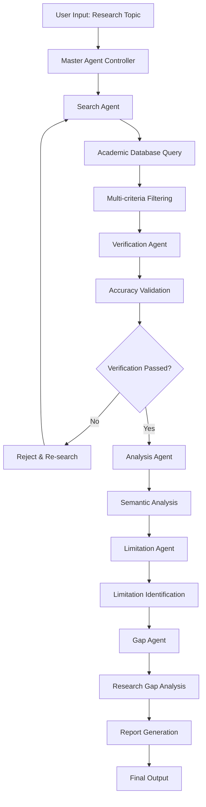
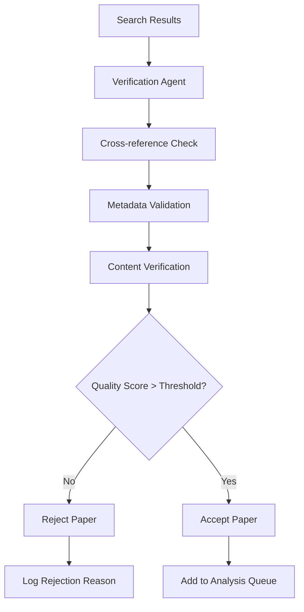

# RA4U - High-level Design Document

## 📋 System Overview

RA4U (Research Assistant 4 You) is a multi-agent AI system designed to assist researchers in literature review, limitation analysis, and research gap identification. The system employs a sophisticated agentic architecture to ensure accuracy and minimize hallucination in academic research.

## 🏗️ System Architecture

### Core Components

```
┌─────────────────────────────────────────────────────────────┐
│                    RA4U Research Assistant                  │
├─────────────────────────────────────────────────────────────┤
│  User Interface Layer                                      │
│  ┌─────────────────┐  ┌─────────────────┐                  │
│  │   Web Interface │  │   API Gateway   │                  │
│  └─────────────────┘  └─────────────────┘                  │
├─────────────────────────────────────────────────────────────┤
│  Agent Orchestration Layer                                 │
│  ┌─────────────────────────────────────────────────────────┐│
│  │              Master Agent Controller                    ││
│  └─────────────────────────────────────────────────────────┘│
├─────────────────────────────────────────────────────────────┤
│  Specialized Agent Layer                                   │
│  ┌─────────────┐ ┌─────────────┐ ┌─────────────┐          │
│  │   Search    │ │  Verification│ │  Analysis   │          │
│  │   Agent     │ │    Agent     │ │    Agent    │          │
│  └─────────────┘ └─────────────┘ └─────────────┘          │
│  ┌─────────────┐ ┌─────────────┐                          │
│  │  Limitation │ │  Gap        │                          │
│  │  Agent      │ │  Agent      │                          │
│  └─────────────┘ └─────────────┘                          │
├─────────────────────────────────────────────────────────────┤
│  Data Processing Layer                                     │
│  ┌─────────────┐ ┌─────────────┐ ┌─────────────┐          │
│  │   RAG       │ │  Vector     │ │  Knowledge  │          │
│  │  Engine     │ │  Database   │ │   Base      │          │
│  └─────────────┘ └─────────────┘ └─────────────┘          │
├─────────────────────────────────────────────────────────────┤
│  External Services Layer                                   │
│  ┌─────────────┐ ┌─────────────┐ ┌─────────────┐          │
│  │  Academic   │ │  Citation   │ │  Conference │          │
│  │  Databases  │ │  APIs       │ │  APIs       │          │
│  └─────────────┘ └─────────────┘ └─────────────┘          │
└─────────────────────────────────────────────────────────────┘
```

## 🤖 Agent Architecture

### 1. Master Agent Controller
- **Purpose**: Orchestrates the entire research workflow
- **Responsibilities**:
  - Receive user queries and research topics
  - Coordinate between specialized agents
  - Manage workflow state and data flow
  - Generate final comprehensive reports

### 2. Search Agent
- **Purpose**: Discovers relevant academic papers
- **Responsibilities**:
  - Query multiple academic databases (arXiv, PubMed, IEEE, ACM)
  - Apply multi-criteria filtering (topic similarity, citation count, conference tier)
  - Rank papers by relevance and quality metrics
  - Return curated list of related works

### 3. Verification Agent
- **Purpose**: Ensures accuracy and prevents hallucination
- **Responsibilities**:
  - Cross-reference paper existence and metadata
  - Validate citation information
  - Verify content authenticity
  - Flag potential hallucinated papers

### 4. Analysis Agent
- **Purpose**: Processes and analyzes academic papers
- **Responsibilities**:
  - Extract key information from papers
  - Perform semantic analysis
  - Calculate similarity scores
  - Identify paper characteristics and focus areas

### 5. Limitation Agent
- **Purpose**: Identifies limitations in existing research
- **Responsibilities**:
  - Analyze methodology limitations
  - Identify scope constraints
  - Detect experimental limitations
  - Categorize types of limitations

### 6. Gap Agent
- **Purpose**: Identifies research gaps and opportunities
- **Responsibilities**:
  - Synthesize limitation analysis
  - Identify unexplored research areas
  - Propose novel research directions
  - Generate actionable research recommendations

## 🔄 Workflow Design

### Primary Research Workflow



### Quality Assurance Workflow



## 📊 Data Flow Architecture

### Input Processing
1. **User Query**: Natural language research topic or domain
2. **Query Preprocessing**: Topic extraction, keyword generation, domain classification
3. **Search Strategy**: Multi-database query planning

### Search & Retrieval
1. **Parallel Search**: Query multiple academic databases simultaneously
2. **Result Aggregation**: Combine and deduplicate results
3. **Initial Filtering**: Apply basic relevance filters

### Verification & Validation
1. **Existence Check**: Verify paper existence across databases
2. **Metadata Validation**: Check publication details, authors, venues
3. **Content Verification**: Validate abstract and key content accuracy

### Analysis & Processing
1. **Semantic Analysis**: Extract key concepts and themes
2. **Similarity Scoring**: Calculate topic relevance scores
3. **Limitation Extraction**: Identify research limitations
4. **Gap Analysis**: Synthesize gaps and opportunities

### Output Generation
1. **Report Structuring**: Organize findings logically
2. **Citation Formatting**: Standardize academic citations
3. **Recommendation Generation**: Create actionable research directions

## 🔧 Technology Stack

### Core Technologies
- **LLM Framework**: OpenAI GPT-4, Anthropic Claude, or open-source alternatives
- **Agent Framework**: LangChain, AutoGen, or custom multi-agent system
- **Vector Database**: Pinecone, Weaviate, or Chroma for semantic search
- **RAG Implementation**: LangChain RAG, LlamaIndex, or custom implementation

### External Integrations
- **Academic APIs**: arXiv API, PubMed API, IEEE Xplore API, ACM Digital Library
- **Citation Services**: CrossRef API, Semantic Scholar API
- **Conference Databases**: DBLP, Google Scholar API

### Infrastructure
- **Backend**: Python with FastAPI or Flask
- **Frontend**: React.js or Vue.js for web interface
- **Database**: PostgreSQL for metadata, Redis for caching
- **Deployment**: Docker containers with Kubernetes orchestration

## 🎯 Key Design Principles

### 1. Accuracy First
- Multi-layer verification mechanisms
- Cross-reference validation
- Hallucination detection and prevention

### 2. Modularity
- Independent agent design
- Loose coupling between components
- Easy to add new agents or modify existing ones

### 3. Scalability
- Horizontal scaling of agents
- Asynchronous processing
- Caching and optimization strategies

### 4. Transparency
- Clear audit trails
- Explainable AI decisions
- Detailed logging and monitoring

## 🔒 Security & Privacy

### Data Protection
- Secure API communications
- Encrypted data storage
- User data anonymization

### Academic Integrity
- Proper citation practices
- Source attribution
- Plagiarism prevention measures

## 📈 Performance Considerations

### Optimization Strategies
- Parallel processing for multiple agents
- Caching frequently accessed data
- Incremental processing for large datasets
- Smart query optimization

### Monitoring & Metrics
- Agent performance tracking
- Accuracy measurement
- Response time monitoring
- User satisfaction metrics

---

*This high-level design serves as the foundation for detailed technical implementation in the low-level design document.*
